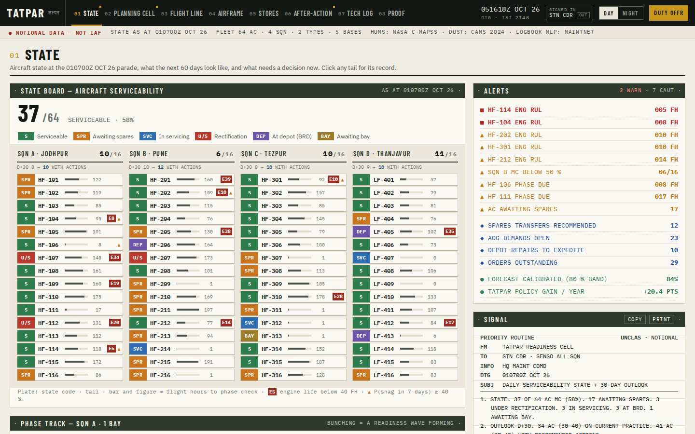
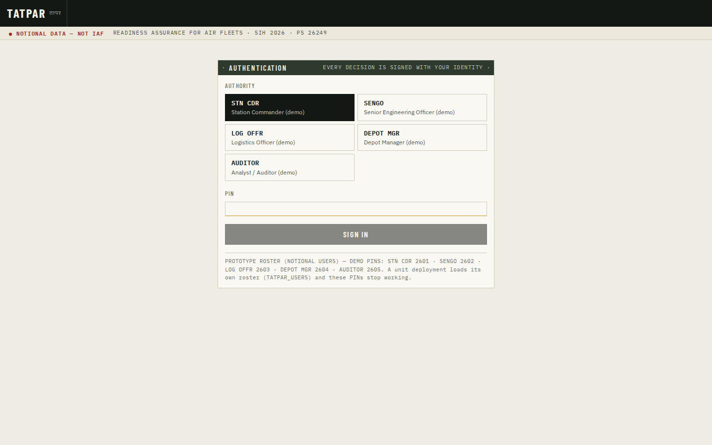
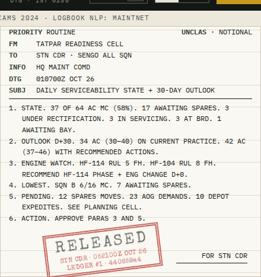
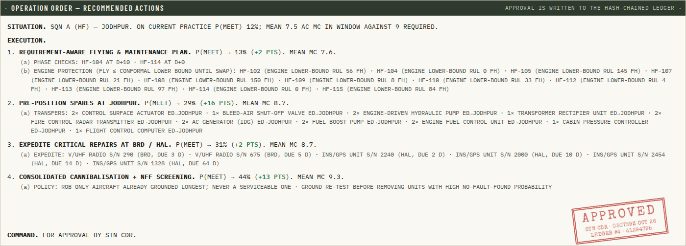
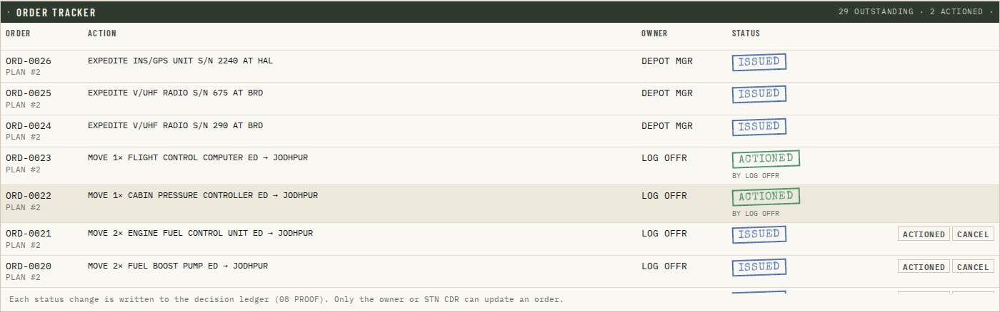
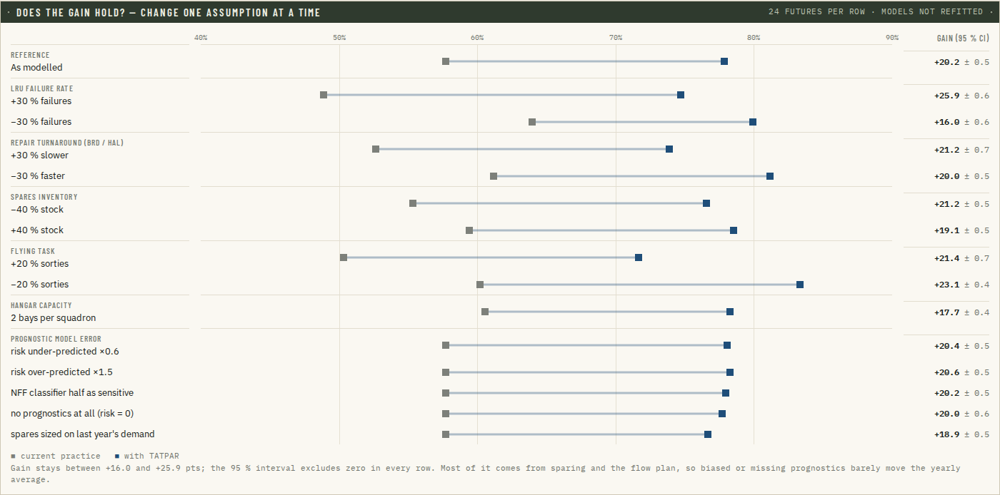
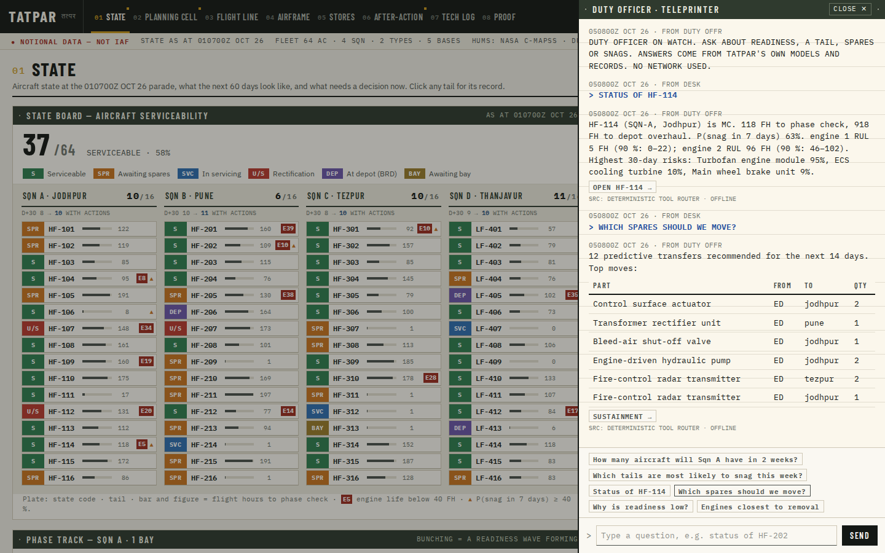

# TATPAR (तत्पर) — Readiness Assurance Platform for Air Fleets

**SIH 2026 · Problem Statement 26249 — Air Power: Predictive Maintenance & Fleet Availability** · Ministry of Defence / DSSC · Software · Transportation & Logistics

> **Others predict failures. TATPAR assures readiness.**

TATPAR joins up health monitoring, technical records, spares and repair-agency data, then plans flying, maintenance and spares so the required number of aircraft is mission-capable on the day of need — **with stated confidence**.



## The ops room

The interface is built for the people who run a station, not as a generic dashboard: eight numbered boards on a command strip with a live date-time group, the signed-in authority, and a DAY / NIGHT switch. Everyone signs in; what you may decide depends on your role and is enforced by the server (only STN CDR approves a readiness plan; SENGO files snags; LOG OFFR / DEPOT MGR action their orders; the auditor can look and analyse but not decide).

| Board | What it answers |
|---|---|
| **01 State** | Tail-plate board of all 64 aircraft (state code, hours to phase, engine and snag flags), cockpit-style alert list, auto-written **daily serviceability signal** released with a rubber-stamp approval, phase track and 60-day outlook |
| **02 Planning Cell** | The requirement as one sentence with editable fields → P(meet) staircase → numbered **operation order** → stamped approval into the ledger → **order tracker**: one order per action, routed to its owner and tracked to ACTIONED |
| **03 Flight Line** | Phase track whose aircraft tokens slide between today, +180 days current practice and +180 days TATPAR; CP-SAT flying programme; engine protection |
| **04 Airframe** | Fleet register, **whiteprint condition drawing** with numbered callouts, engine RUL trend + module attribution, component record, Form-700 technical log |
| **05 Stores** | Supply-chain schematic (squadron stores ↔ equipment depot ↔ BRD / HAL), RBS frontier, AOG decision board, transfers, expedites, NFF and rogue units |
| **06 After-Action** | Loss waterfall, lever staircase, **does the gain hold?** (sensitivity to every assumption), readiness waves |
| **07 Tech Log** | File a snag in a Form-700 line (Hinglish welcome) → it is recorded in the aircraft's log, coded to an ATA chapter, with a removal decision, what fixed it before, and similar entries |
| **08 Proof** | Provenance and lineage, CSV export validation **and import into the tech log**, calibration evidence, federated learning, model data plates, the signed hash-chained decision ledger |

| Sign-in | Released signal | Approved operation order |
|---|---|---|
|  |  |  |
| **Order tracker** | **Does the gain hold?** | **Duty officer** |
|  |  |  |

All boards, day and night: [docs/screenshots](docs/screenshots).

## Results at a glance

| What | Result | Data |
|---|---|---|
| Fleet availability, one year, full policy vs current practice | **57.7 % → 78.1 % mission-capable (+20.4 ± 0.6 pts ≈ 13 more aircraft every day)** — same fleet, same spares budget | Notional 64-aircraft fleet, 24 hidden-truth futures, common random numbers |
| Does it survive different assumptions? | gain stays **+16 to +26 pts** with failure rates ±30 %, repair times ±30 %, stock ±40 %, flying task ±20 %, two bays, biased or missing prognostics; 95 % CI excludes zero in all 15 cases | Notional, [sensitivity table](docs/04-evaluation.md#5b-does-the-gain-survive-different-assumptions-one-year-24-hidden-truth-futures-each) |
| Readiness-based sparing (same ₹172 crore inventory) | modelled supply availability 83 % → 96 %; +10 pts mission-capable in the twin | Notional |
| Phase-flow flight & maintenance plan (CP-SAT) | removes hangar queues (awaiting-bay 9.8 % → 0.2 %); +10 pts | Notional |
| Readiness-backward planner (≥ 9 MC at Jodhpur, D+14–17, surge ×1.2) | P(meet) 12 % → 46 % | Notional |
| Engine RUL (LightGBM quantile + conformal) | RMSE 12.8 / 13.9 / 13.1 / 14.0 cycles on FD001–FD004; 90 % interval coverage 82.7 % → **90.4 %** after conformal calibration | NASA C-MAPSS official test sets |
| Readiness forecast calibration | P10–P90 band contains 84 % of true outcomes (nominal 80 %) | Notional |
| Federated learning across 5 bases | data-poor Leh detachment: RMSE 37.1 → 14.6 cycles without sharing raw data | NASA C-MAPSS |
| No-Fault-Found predictor / rogue units | AUC 0.81 (47 % of NFF caught at 8 % false re-tests) / 100 % precision | Notional |
| ATA auto-coding of real logbook text | agrees with **what was actually repaired 75 %** of the time (keyword rule 69 %, majority class 64 %); not much better than the keywords once they are removed — see honesty notes | MaintNet aviation logbook |

Full, auto-generated numbers: [docs/04-evaluation.md](docs/04-evaluation.md). **All fleet figures come from a notional fleet simulated by the TATPAR Fleet Twin — they are not IAF results.**

## What makes it different

Seven other public projects target PS 26249; all predict *which part fails*. TATPAR answers the commander's three questions:

1. **"How many aircraft on day D — and how sure?"** — Monte-Carlo runs of a **Fleet Twin of the whole sustainment system** (aircraft, installed LRUs, stock at each echelon, BRD/HAL repair pipeline, hangar bays, crews) driven only by model predictions → calibrated P10–P90 forecasts.
2. **"What must I do today to have N ready?"** — **Readiness-backward planning**: a requirement-aware CP-SAT flight & maintenance plan, predictive spares transfers, depot expedite and consolidated cannibalisation, each action scored by its own gain in P(meet), then approved into a **hash-chained audit log**.
3. **"Where is readiness lost — and why?"** — a loss waterfall and lever study that exposes, for example, that fixing spares alone moves the bottleneck to the hangar.

Plus: **Readiness-Based Sparing (two-echelon VARI-METRIC) with prognostic demand**, **No-Fault-Found / rogue-unit / cannibalisation** analytics, a **Base Environmental Severity Index** from real CAMS dust data, **Hinglish-aware snag intelligence**, **federated learning** across bases, and a fully **offline** deployment.

## Submission pack
- [Idea deck (PPTX)](docs/sih-ppt/TATPAR_SIH26249_Idea.pptx) · [PDF](docs/sih-ppt/TATPAR_SIH26249_Idea.pdf) — 6 slides in SIH template order (fill Team ID / Team Name)
- [01 · Problem research & competitor gap analysis](docs/01-research.md) · [02 · Solution](docs/02-solution.md) · [03 · Architecture](docs/03-architecture.md) · [04 · Evaluation](docs/04-evaluation.md)
- [Demo video script](docs/demo-script.md) · [Screenshots](docs/screenshots)

## Run it

**Requirements:** Python 3.10+, Node 20+ (or just Docker). CPU laptop is enough.

```bash
make setup      # venv + backend + frontend deps
make train      # download NASA C-MAPSS & MaintNet, generate the notional fleet, train all models   (~1–2 min)
make bench      # Monte-Carlo studies, RBS, plans, federated learning, sensitivity → docs/04-evaluation.md (~9 min; reproduces the published numbers exactly)
make ui         # build the React app
make serve      # http://localhost:8000
```
**Sign in:** the prototype ships a notional roster, one user per role (STN CDR, SENGO, LOG OFFR, DEPOT MGR, AUDITOR); the demo PINs are printed on the sign-in screen. For a unit deployment set `TATPAR_USERS` (roster JSON with PBKDF2 hashes from `python -m tatpar.trust.auth hash <pin>`) and `TATPAR_SECRET`; the demo PINs then stop working.

Development: `make dev` (API on :8000, Vite on :5173 with hot reload). Tests: `make test` (40 backend tests) and, with the server running, `cd frontend && npm run e2e` (drives the real UI: sign-in, role gating, filing, approving, actioning an order, all boards day/night, phone width). CI runs both on every push (`.github/workflows/ci.yml`).

**Offline / air-gapped:** `docker compose up --build` bakes datasets, models and the benchmark cache into the image at build time; the container then runs with no network.

**Optional local LLM for the copilot:** set `TATPAR_LLM_URL=http://localhost:11434/api/chat` and `TATPAR_LLM_MODEL=<model>` (Ollama-compatible). Without it, the copilot uses a deterministic tool router — still offline, still cited.

**GPU notebooks (Colab):** [`notebooks/01_engine_rul_deep.ipynb`](notebooks/01_engine_rul_deep.ipynb) (1D-CNN + Transformer quantile RUL + conformal calibration), [`notebooks/02_federated_bases.ipynb`](notebooks/02_federated_bases.ipynb) (FedAvg / FedProx, Flower deployment).

## Repository map

```
backend/tatpar/
  domain/        catalogue (bases, squadrons, checks, 25 LRU types), environment severity index
  data/          NASA C-MAPSS and MaintNet loaders
  datagen/       two-year notional history from the Fleet Twin (+ logbook-style snag text)
  twin/          Fleet Twin simulator, policies, Monte-Carlo forecasting, readiness-loss KPIs
  prognostics/   engine RUL + conformal, Weibull AFT survival, NFF / rogue / chronic detectors, belief layer
  nlp/           ATA auto-coding, similar-case retrieval, fix effectiveness
  optimize/      CP-SAT flight & maintenance planning, VARI-METRIC sparing, advisors, requirement planner
  federated/     FedAvg across bases
  trust/         hash-chained audit log
  api/           FastAPI routers (+ offline copilot)
  pipelines/     build_all (data → models), bench (experiments → docs)
frontend/        React + TypeScript + Tailwind + ECharts ops room (8 boards, day/night, fonts bundled offline)
notebooks/       Colab GPU notebooks
docs/            research, solution, architecture, evaluation, deck, screenshots
```

## Honesty notes
- No classified or real IAF data is used. Public data: NASA C-MAPSS (engine degradation), MaintNet (aviation logbooks), CAMS 2024 dust via Open-Meteo. Everything else is a notional fleet with **hidden ground truth**; the analytics learn only from the records the twin emits.
- Policies are compared on many hidden-truth futures with common random numbers and reported with 95 % confidence intervals. Small levers (bundling, NFF screening, scheduled work while awaiting spares) show gains within noise in this notional fleet and are reported as such.
- **The headline gain rests on assumptions about a notional fleet.** [Section 5b of the evaluation](docs/04-evaluation.md) changes each one (failure rates, repair turnaround, stock, flying task, bays, prognostic accuracy) and the gain stays between +16 and +26 points. Most of it comes from readiness-based sparing and the phase-flow plan, so it barely depends on prognostic accuracy over a year; the models matter for short-horizon decisions (engine protection, P(meet) for a specific requirement).
- **Engine RUL is proven on NASA C-MAPSS, a commercial-turbofan simulation measured in cycles**, converted to fighter flight hours with an assumed 3 FH per cycle. It demonstrates the method (quantile model + conformal calibration + module attribution), not a fighter-engine model; a unit would retrain on its own HUMS data.
- **The snag coder is graded against what was repaired, not against the keyword rule that labelled it.** On real MaintNet text it beats the rule modestly (75 % vs 69 %) and, with keywords removed, is no better than guessing the most common chapter. The 100 % on fleet snags is templated synthetic text. A unit deployment needs a few hundred expert-coded entries.
- Every recommendation is decision support: a signed-in human approves it, the approval is logged under their identity, and the orders it issues are tracked to completion.

## Data sources & references
See [docs/01-research.md](docs/01-research.md). Key: Saxena et al. 2008 (C-MAPSS); Romano et al. 2019 (CQR); Sherbrooke 1986 (VARI-METRIC); Kozanidis (Hellenic AF FMP); Peschiera et al. 2020 (French AF FMP); Mattila & Virtanen 2014; GAO-02-86 (cannibalisation); Akhbardeh et al. 2020 (MaintNet); CAPS Issue Brief 08/25.
