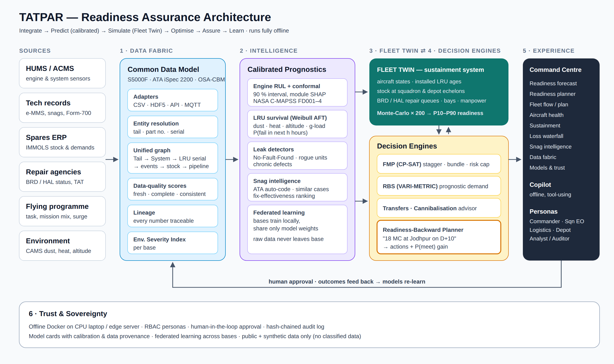

# 03 · Architecture



## 1. Layers

| Layer | Responsibility | Key technology | Code |
|---|---|---|---|
| 1 · Data fabric | Ingest HUMS, tech logs, spares, depot status, flying programme, environment; map to the common data model; entity resolution; data-quality scores; lineage | Pandas, Pydantic, SQLite/Parquet (Postgres + TimescaleDB in production) | `backend/tatpar/data`, `backend/tatpar/domain` |
| 2 · Intelligence | Engine RUL with conformal intervals; LRU survival; NFF, rogue-unit and chronic-defect detection; snag NLP; federated learning | LightGBM, SHAP, lifelines, scikit-learn | `backend/tatpar/prognostics`, `backend/tatpar/nlp`, `backend/tatpar/federated` |
| 3 · Fleet Twin | Day-stepped simulation of the sustainment system with common random numbers; Monte-Carlo readiness forecast | NumPy, multiprocessing | `backend/tatpar/twin` |
| 4 · Decision engines | FMP (flying + checks), RBS (VARI-METRIC), lateral transfers, cannibalisation advisor, readiness-backward planner, loss waterfall | OR-Tools CP-SAT, SciPy | `backend/tatpar/optimize` |
| 5 · Experience | Command centre (10 views), persona switcher, copilot | FastAPI, React + TypeScript, ECharts | `backend/tatpar/api`, `frontend/` |
| 6 · Trust & sovereignty | Offline deployment, RBAC, human approval, hash-chained audit, model cards | Docker Compose, SHA-256 chain | `backend/tatpar/trust` |

## 2. Common data model (aligned to ASD S5000F / ATA iSpec 2200 / MIMOSA OSA-CBM)

```
Base ──< Squadron ──< Aircraft (tail) ──< InstalledPosition (ATA chapter, LRU type, QPA)
                                     │            └── SerialisedItem (serial, age_hours, repairs)
                                     ├──< Sortie (date, hours, mission, g-severity)
                                     ├──< Snag (text, ATA, reported_by, chronic flag)
                                     ├──< MaintenanceEvent (scheduled check | unscheduled | cannibalisation)
                                     │        └──< Removal ──> ShopFinding (confirmed | NFF) ──> RepairOrder (BRD/HAL, TAT)
                                     └──< StatusDay (MC | NMCM-S | NMCM-U | NMCS | DEPOT)
StockPoint (base store | equipment depot) ──< StockLevel (LRU type, on-hand, due-in, backorders)
SupplyTransaction (issue, receipt, lateral transfer, demand)
EngineHealthSnapshot (cycle, op settings, 21 sensors)  ← HUMS (OSA-CBM: DA → DM → SD → HA → PA → AG)
EnvironmentIndex (base, dust, heat, humidity, altitude → severity)
```

| Our entity | S5000F concept | OSA-CBM layer |
|---|---|---|
| Aircraft, InstalledPosition | Product, Breakdown element | — |
| SerialisedItem | Serialised product item | — |
| Sortie | Operation / usage | Data acquisition |
| EngineHealthSnapshot | Health monitoring data | DA / DM |
| Snag | Failure / malfunction report | State detection |
| Removal, ShopFinding | Maintenance task performed, shop findings (incl. NFF) | Health assessment |
| RUL interval, P(fail) | — | Prognostics assessment |
| Plan, actions | — | Advisory generation |

## 3. Data flow for one decision

1. HUMS snapshot arrives → engine RUL model returns a calibrated interval (e.g. 61 [44, 83] cycles) and module attribution (HPC).
2. Survival models update P(fail in next 25 h) for every installed LRU on that tail, adjusted for the base's environmental severity and the tail's mission mix.
3. The Fleet Twin samples failure times from these distributions and simulates 60 days × 200 replications under the current plan → readiness fan chart and P(meet requirement).
4. The FMP optimiser re-plans flying hours and check starts (bundling the predicted engine module work into the next phase check); RBS/transfers move spares toward bases with predicted demand.
5. The planner re-runs the twin with each action to measure its marginal readiness gain → ranked action list.
6. A human approves; the approval is appended to the hash-chained audit log; the outcome (actual failure, shop finding) flows back as new training data.

## 4. Deployment

- **Single command, offline:** `docker compose up` → backend (FastAPI + pre-built artifacts) and frontend (static build served by nginx). No internet needed at runtime; datasets and environment data are cached at build time.
- **Edge / forward base:** the same image runs on a ruggedised CPU server; federated learning rounds sync model weights over AFNET when a link is available.
- **Production path:** Postgres + TimescaleDB for HUMS, message bus (MQTT/Kafka) for streaming, Flower for federated orchestration, integration adapters for IMMOLS and e-MMS exports, PKI-backed signing for the audit chain.

## 5. Non-functional targets

| Concern | Target |
|---|---|
| Readiness forecast (64 tails × 60 days × 200 runs) | < 15 s on a 4-core laptop |
| FMP solve (64 tails × 30 days) | ≤ 20 s time limit, warm-started |
| API latency for dashboards | < 300 ms (cached artifacts) |
| Security | RBAC personas, audit chain, no external calls at runtime |
| Data | Public + synthetic only; every figure labelled notional or sourced |
